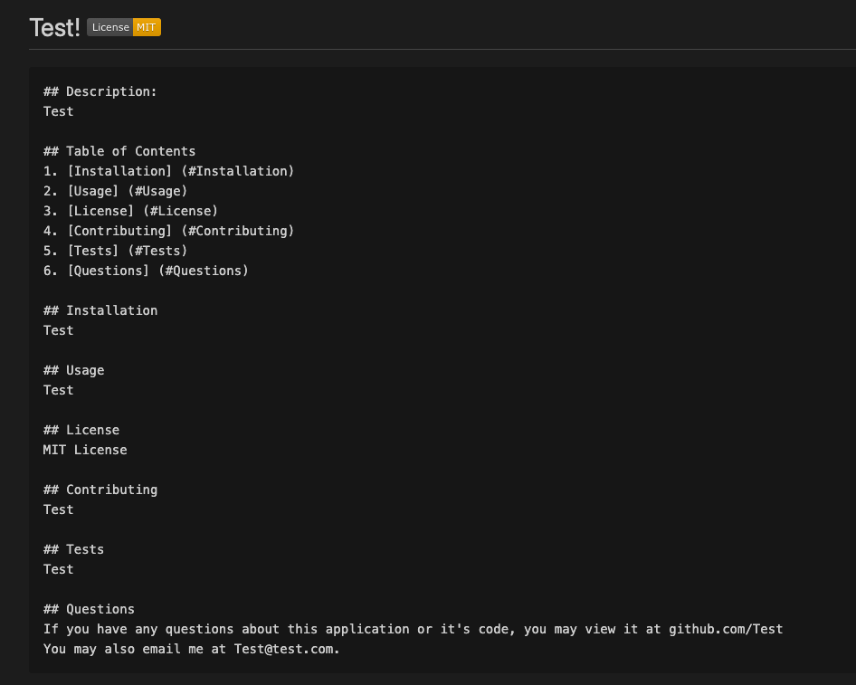

# README Generator

Deployed Link: laurenzel93.github.io/README-generator/  
Repo Link: github.com/Laurenzel93/README-generator  
 
This app will generate a README.md file based on the input entered by the user into the command line  
 
Techologies: JavaScript, Node 

